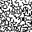
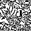
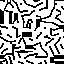

# ConvChain (Rust Port)

A port of Maxim Gumin's [ConvChain] to Rust:
 
> ConvChain is a Markov chain of images that converges to input-like images.
> That is, the distribution of NxN patterns in the outputs converges to the distribution
> of NxN patterns in the input as the process goes on.

Please have a look on the [original repo](https://github.com/mxgmn/ConvChain) for a
more thorough description of the application of the [Metropolis algorithm] to the problem. 

```rust
fn main() {
    // Generate a sample (this is the SimpleMaze example):
    let pattern = [
        true,  true,  true,  true,
        true, false, false, false,
        true, false,  true, false,
        true, false, false, false,
    ];
    let sample = ConvChainSample::new(&pattern, 4, 4);

    // Initialize the chain using given sample and a
    // - 32x32 output size
    // - receptor size of 2
    // - temperature of 1.0
    let mut chain = ConvChain::new(&sample, 32, 2, 1.0);
    
    // Generate the 32x32 field using 10 iterations.
    let field: &[bool] = chain.process(10);
}
```

## Example run

Here are a couple of outputs generated with the code, using different values
for the receptor size and number of iterations:

| Input | r=3, it=10 | r=5, it=10 | r=5, it=20 | r=5, it=100 |  
|---|---|---|---|---|
|  |  |  |  |  |

This repository provides ports of both original "slow" and "fast" implementations. 
To run the example, execute the following from the repository root:

```console
$ cargo run --release --example fast
```

This will process the jobs defined in [resources/samples.xml] and produce output images
in the current directory.

To run the benchmarks, execute

```console
$ cargo bench
```

[ConvChain]: https://github.com/mxgmn/ConvChain
[resources/samples.xml]: resources/samples.xml
[Metropolis algorithm]: https://en.wikipedia.org/wiki/Metropolis%E2%80%93Hastings_algorithm
